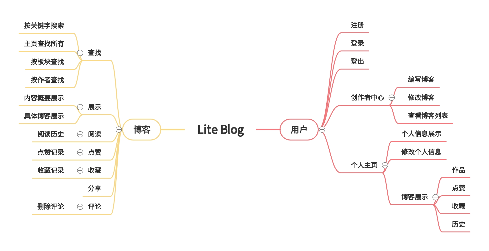
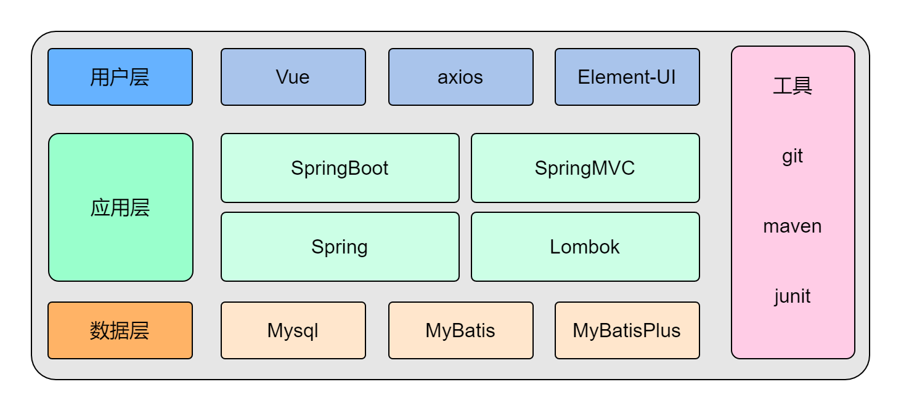
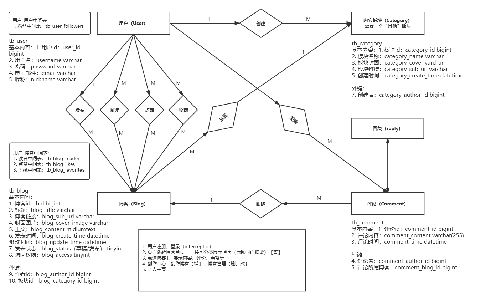
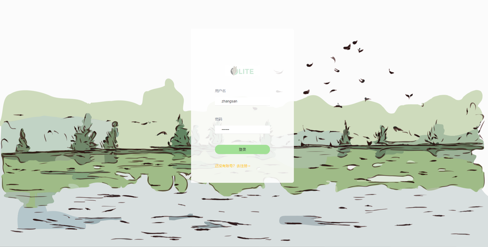
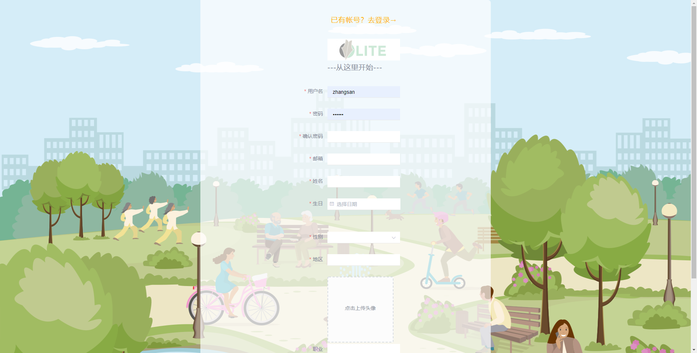
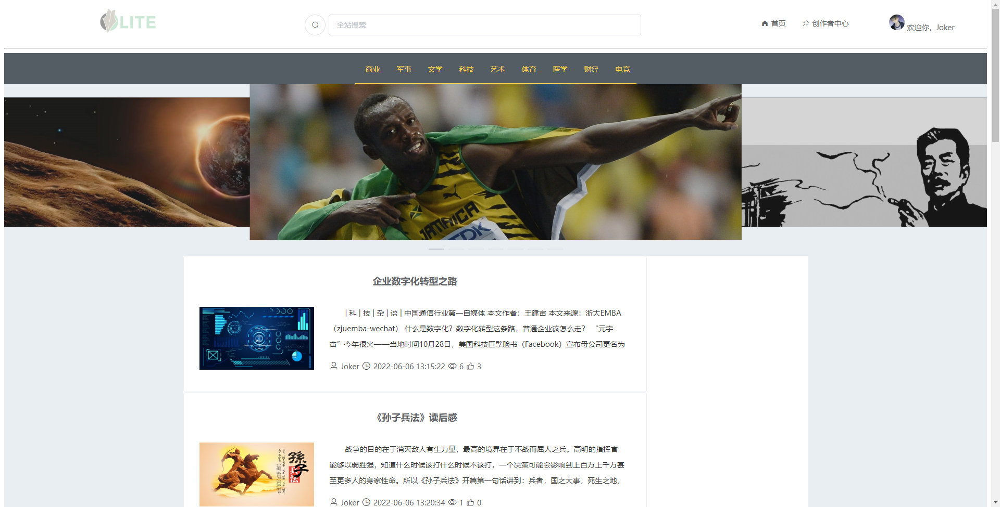
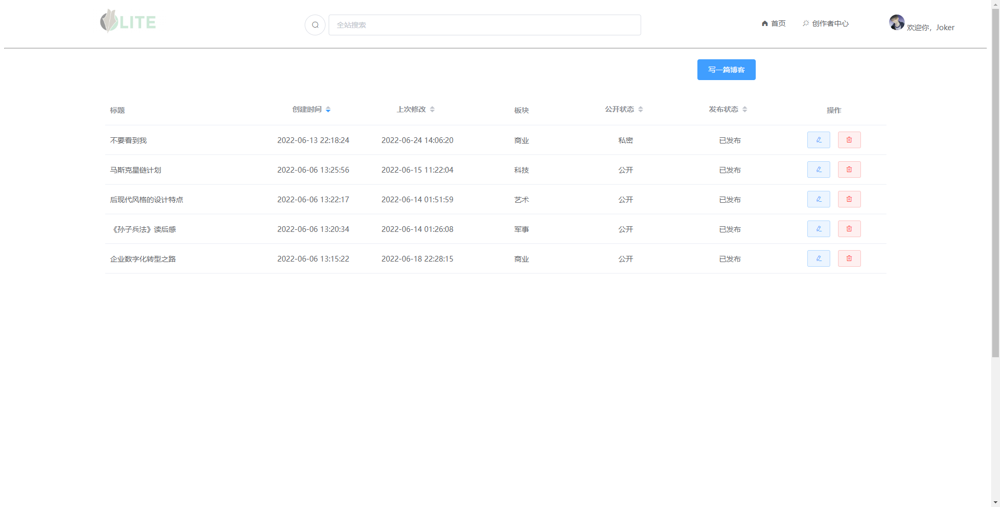
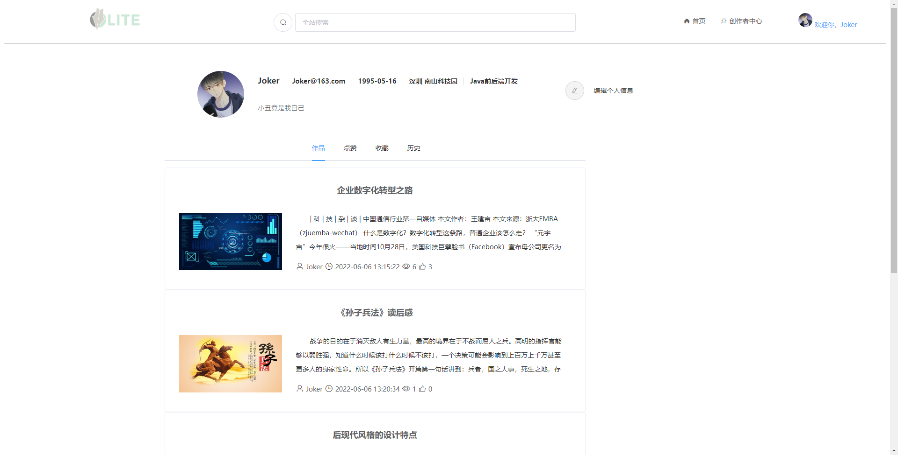

# 博客项目开发文档

## 1.项目简介

$\textcolor{Maroon}{注意：运行 LiteBlogApplication 即可启动项目，运行前请先阅读本文档并进行以下重要配置：} $

1. 导入数据库：请将根目录下的 lite_blog_db.sql 文件，安装进您的 MySQL 数据库；
2. 配置文件（application.properties）：配置默认端口号为 8080（建议不要修改），请配置您的数据库 username 以及 password，另外将参数 liteblog.path 修改为您本地的项目存放的文件路径；
3. 运行 LiteBlogApplication，打开浏览器，访问 http://localhost:8080/index.html；
4. 首次访问需要登录，您可以使用默认用户名：zhangsan，密码：123456；
5. 开始体验吧~

### 1.1项目背景

* Lite-blog轻博客项目适合java初学者练手使用。该项目采用SSMP框架进行开发，实现了一个简易版轻量级的大众博客平台。
* 主要核心功能包括阅读、发表、编辑博客；评论、点赞、收藏；个人主页展示、分版块管理等功能。

### 1.2 项目功能

* 博客项目核心功能围绕用户和博客两条主线展开：围绕“用户”线索开发注册、登录、登出、个人主页，创作中心等内容；围绕“博客”线索开发写博客、查看博客、博客搜索、点赞、收藏、评论，以及分版块展示等功能。
* 

### 1.3技术选型

* 该项目主要采用以SSMP框架为核心，采用了前后端分离的开发方式，同时整合Mybatis，具体技术选型如下：
* 
* 用户层-前端：采用Vue框架，引入ElementUI组件，并使用了axios技术；
* 应用层：SpringBoot+SpringMVC+Lombok
* 数据层：Mysql数据库+MyBatisPlus快速开发
* 工具：Maven创建工程，git版本控制，Junit单元测试

## 2.开发过程

### 2.1数据库设计

* 根据博客功能设计，主要创建三张主表：Table User,Table Blog,Table Category；根据具体的功能需求，针对每一个主表进行字段和属性设计，具体如下：
* 

  ​														（如不清晰可放大查看）

### 2.2 环境搭建

* 项目使用IDEA开发工具，首先创建Maven工程，project Lite_blog ，创建包结构com.lite，JDK为1.8版本，注意设置Maven仓库配置；

* pom文件导入SpringBoot依赖包以及与项目相关的其他坐标，具体信息可查看pom文件；

* application.properties配置文件，注意在Mysql配置时将url,username,password修改为当前用户的具体信息；

* 该项目是Spring Boot项目，因此需要创建一个LiteBlogApplication启动类，开启项目；

  ```
  @SpringBootApplication
  @ServletComponentScan
  public class LiteBlogApplication {

      public static void main(String[] args) {
          SpringApplication.run(LiteBlogApplication.class, args);
      }

  }
  ```

​     其中@ServletComponentScan是拦截器的注解。

## 2.3 后端开发

### 2.3.1 基础准备工作

* 首先根据数据库表创建对应的实体类:User,Blog,Category,并加入@Data注解（Lombok）；

* 创建Mapper，Service，Controller；

* 创建Common包结构，并创建了R对象，该项目将所有的数据封装到R对象作为返回结果类；同时创建BaseContext基于ThreadLocal封装工具类，方便后续开发时使用；自定义一个元数据处理对象MyMetaObjectHandle处理器，用于Entity类中createTime等公共自段填充；

  ```java
  @Component
  @Slf4j
  public class MyMetaObjectHandler implements MetaObjectHandler {
      @Override
      public void insertFill(MetaObject metaObject) {
          log.info("公共字段自动填充[insert]");
          log.info(metaObject.toString());
          metaObject.setValue("createTime", LocalDateTime.now());

      }

      @Override
      public void updateFill(MetaObject metaObject) {
          log.info("公共字段自动更新[update]");
          log.info(metaObject.toString());
          metaObject.setValue("updateTime",LocalDateTime.now());
      }
  }
  ```

* 创建Config包结构，其中创建WebMvcConfig，用于静态资源映射处理

  ```java
  @Configuration
  @Slf4j
  public class WebMvcConfig extends WebMvcConfigurationSupport {
      @Override
      protected void addResourceHandlers(ResourceHandlerRegistry registry) {
          log.info("开始静态资源映射");
          registry.addResourceHandler("/**").addResourceLocations("classpath:/");
          registry.addResourceHandler("/templates/**").addResourceLocations("classpath:/templates/");
      }
  }
  ```

### 2.3.2 功能开发

####    User层

* 用户登录模块功能开发-拦截器-LoginCheckFilter

* 用户注册功能

  ```java
  @PostMapping
  public R<User> register(User user)
  ```

* 用户登录功能

  ```java
  @PostMapping("/login")
  public R<User> login(HttpServletRequest request, @RequestBody User user)
  ```

*  用户退出登录功能

  ```java
  @PostMapping("/logout")
  public R<String> logout(HttpServletRequest request)
  ```

* 获取用户个人信息

  ```java
  @GetMapping("/{userId}")
  public R<User> getById(@PathVariable Long userId)
  ```


* 用户修改个人信息

  ```java
  @PutMapping
  public R<String> update(@RequestBody User user)
  ```

  ​

####    Blog层

* 获取所有带有作者名字、板块名称的博客

  ```java
  @GetMapping("/getAllDto")
  public R<List<BlogDto>> getAllDto()
  ```

* 根据博客id查询博客

  ```java
  @RequestMapping(value = "/{blogId}", method = RequestMethod.GET)
  public R<BlogDto> getById(@PathVariable Long blogId)
  ```

* 查询当前用户所写的所有博客

  ```java
  @GetMapping("/getByAuthorId")
  public R<List<BlogDto>> getByAuthorId(HttpServletRequest request)
  ```

* 根据用户id查找与其对应的博客

  ```java
  @GetMapping("/getByUserId/{userId}")
  public R<List<BlogDto>> getByUserId(@PathVariable Long userId)
  ```

* 根据版块id查询当前版块下所有博客

  ```java
  @GetMapping("/getByCategoryId/{categoryId}")
  public R<List<BlogDto>> getByCategoryId(@PathVariable Long categoryId) 
  ```

* 根据关键词查询博客

  ```java
  @GetMapping("/getByKeyWord/{keyWord}")
  public R<List<BlogDto>> getByKeyWord(@PathVariable String keyWord)
  ```

* 查询用户点赞的博客

  ```java
  @GetMapping("/getLikesByUserId/{userId}")
  public R<List<BlogDto>> getLikesByUserId(@PathVariable Long userId)
  ```

* 查询用户收藏的博客

  ```java
  @GetMapping("/getFavoritesByUserId/{userId}")
  public R<List<BlogDto>> getFavoritesByUserId(@PathVariable Long userId)
  ```

* 查询用户阅读的博客

  ```java
  @GetMapping("/getHistoryByUserId/{userId}")
  public R<List<BlogDto>> getHistoryByUserId(@PathVariable Long userId)
  ```

* 新增博客

  ```java
  @PostMapping
  public R<String> save(Blog blog, HttpServletRequest request)
  ```

* 修改博客

  ```java
  @PutMapping
  public R<String> update(@RequestBody Blog blog)
  ```

* 删除博客

  ```java
  @DeleteMapping("/{blogId}")
  public R<String> delete(@PathVariable Long blogId)
  ```

* 提炼的公共方法-根据不同条件查询，获取对应的 BlogDto

  ```java
  public List<BlogDto> getBlogDtoListByCondition(LambdaQueryWrapper<Blog> queryBlog)

  public BlogDto getBlogDtoByCondition(LambdaQueryWrapper<Blog> queryWrapper)

  public List<BlogDto> getBlogDtoListByBlogIdList(List<Long> blogIdList
  ```

  ​

####    Category层

* 查询所有版块

  ```java
  @GetMapping(value = "/list")
  public R<List<Category>> getAll()
  ```

####    Comment层

* 根据博客id查询评论

  ```java
  @GetMapping("/getByBlogId/{blogId}")
  public R<List<CommentDto>> getByBlogId(@PathVariable Long blogId)
  ```

* 新增评论

  ```java
  @PostMapping
  public R<String> save(Comment comment, HttpServletRequest request)
  ```

* 删除评论

  ```java
  @DeleteMapping("/{commentId}")
  public R<String> delete(@PathVariable Long commentId)
  ```

* 提炼公共方法

  ```java
  public List<CommentDto> getCommentDtoByCondition(LambdaQueryWrapper<Comment> queryComment)
  ```

## 2.4 前端开发

* 前端基于Vue框架，采用ElementUI设计样式，在Javascript中使用axios异步交互技术实现发送请求与接受数据；

## 3.效果展示

* 登录页面展示

  ​

  

* 注册页面展示

  

  ​

* 博客首页展示

  

* 创作者中心展示

  

* 个人主页展示

  

